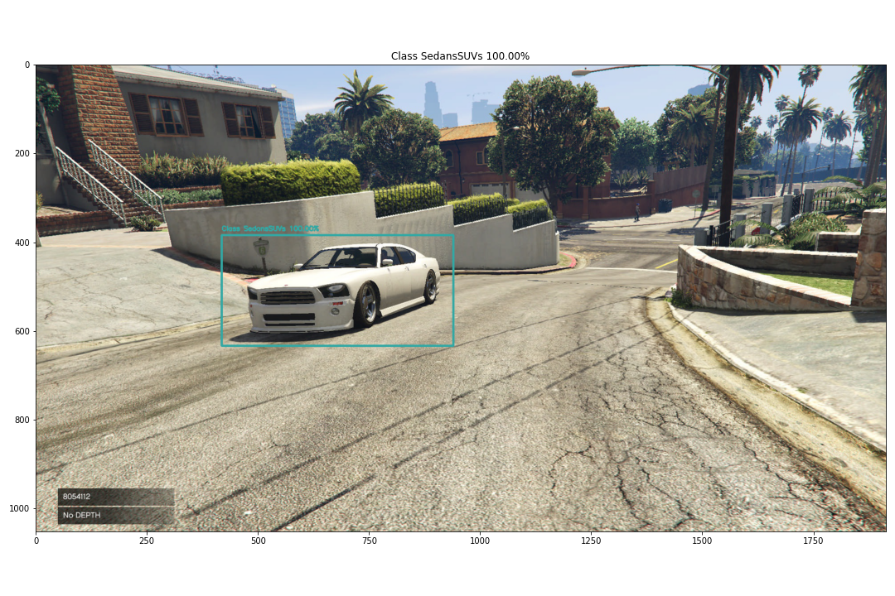

# Vehicle Recognition and Localization

This github contains code used in the ROB 535 - Self Driving Cars: Perception and Controls - perception final project. The perception final project was divided into two tasks: classification and localization of vehicles given perception data. Our team chose to solve these tasks by primarily using a two part deep learning approach. This github explains details on how to train a similiar model and code for evaulating on a test set.

<p align="center">
  
</p>

## General Approach
In our final model our approach consisted of three parts: 1. Running an object detection algorithm to get bounding boxes for vehicle locations in images. 2. Classifying the bounded boxed images using a separate ResNet50 classifier. 3. Localizing vehicle using the lidar in the same area and the centroid of the bounded box. See a diagram detailing our approach below.

<p align="center">
  
</p>

## Result Highlights


## Quick Demo of Model Performance

Use this notebook to demo the model performance. You can download the pre-trained models here.
*   Inference - [Evaluation on Test Images](notebooks/TestModelPerformance.ipynb) 

## Training
If you would like to train your own model, our approach is detailed below.

### Requirements

* Python3.8 or 3.9
* CUDA and CuDNN
* Tensorflow 2.x

### Set-up
In order to get the best performance out of this repository, it is recommened to set up your tensorflow environment on a computer with a GPU and CUDA installed. Please see details [here](https://www.tensorflow.org/install/gpu) on getting CUDA working with Tensorflow.


Additionally, it is recommended to install all dependencies in a virtual environment. 
If on unix, creating this environment would look like the following:
```bash
python -m venv venv
./venv/bin/activate
```

### Tensorflow 2.x Object Detection API Installation
Once you have activated your virtual environment you can start installing the TensorFlow 2.x Object Detection API Python Package. For a more detailed explanantion on installation please take a look at [this](https://tensorflow-object-detection-api-tutorial.readthedocs.io/en/latest/install.html) un-official tutorial.

Begin by cloning the TensorFlow Models repository into your project root directoy. A shallow clone like the following should be sufficent.

```bash
git clone --depth 1 https://github.com/tensorflow/models.git
```
Once cloned, install the object detection API.
```bash
cd models/research
# Compile protos.
protoc object_detection/protos/*.proto --python_out=.
# Install TensorFlow Object Detection API.
cp object_detection/packages/tf2/setup.py .
python -m pip install --use-feature=2020-resolver .
```
After your install, it is recommeneded that you test your installation with the following code:

```bash
# Test the installation.
python object_detection/builders/model_builder_tf2_test.py
```

### Training Part 1

#### Download Training and Evaluation Data
Download Training and evlaution data and put into the `workspace\gta_project` directory.

#### Prepare Data for Training with Object Detection API
The TensorFlow Object Detection API requires that data be stored in a TFRecords format prior to training. 
Running this function will create these records in the annotations folder of your project directory.

```bash
# Create TFRecords
python utils/create_tfrecords.py
```
#### Grab Pre-Trained Model 
From [Tensorflow Model Zoo](https://github.com/tensorflow/models/blob/master/research/object_detection/g3doc/tf2_detection_zoo.md) download and un-zip the [SSD ResNet50 V1 FPN 640x640 (RetinaNet50)](http://download.tensorflow.org/models/object_detection/tf2/20200711/ssd_resnet50_v1_fpn_640x640_coco17_tpu-8.tar.gz) pre-trained model into the following directory: `workspace\gta_project\pre-trained-models`.

#### Training with Object Detection API
After records are created and you have downloaded the pre-trained model you can finally start training. Woot woot! To start training run the follwoing command.

```bash
cd workspace/gta_project
python model_main_tf2.py --model_dir=models/three_class_resnet50_v1_fpn_120821 --pipeline_config_path=models/three_class_resnet50_v1_fpn_120821/pipeline.config
```

Optionally, you can look at the evaluation test data and monitor the loss using tensorboard.
```bash
# Evaluate Hold Out Test Data
python model_main_tf2.py --model_dir=models/three_class_resnet50_v1_fpn_120821 --pipeline_config_path=models/three_class_resnet50_v1_fpn_120821/pipeline.config --checkpoint_dir=models/three_class_resnet50_v1_fpn_120821

# Check on Model using TensorBoard
tensorboard --logdir=models/three_class_resnet50_v1_fpn_120821
```

After the detection model finishes (or if you like what you are seeing before...) export the model for future evaluation.
```bash
python .\exporter_main_v2.py --input_type image_tensor --pipeline_config_path .\models\three_class_resnet50_v1_fpn_120821\pipeline.config --trained_checkpoint_dir .\models\three_class_resnet50_v1_fpn_120821\ --output_directory .\exported-models\three_class_resnet50_v1_fpn_120821
```
### Training Part 2
After training the object detector it is time to improve classification. The instructors of this project thankfully gave us ground truth boxes that can aid with this.

#### Prepare Data for Use with ResNet50 Classification Model
```bash
# Summarize Train and Test Data
python utils\summarize_data.py

# Get Boxes from Summary Table and Resize to Specific Size
python utils\create_segmented_train_data.py
# Run Object Detection Model on Test Data to Get Boxes and Resize to Specific Size
python utils\create_segmented_test_data.py
```
#### Training
Use this notebook to train the segmented regions.
*   Training - [ResNet50 Training](notebooks/ResNet50_TransferLearning_v1_Regions.ipynb)

### Evaluate Model
Use this notebook to test the model performance.
*   Inference - [Evaluation](notebooks/TestModelPerformance.ipynb)


## Contact
Alexander Jaekel - ajaeckel@umich.edu 

Austin Jeffries - ajeffr@umich.edu

Arnav Sharma - arnavsha@umich.edu

Sauraub Sinha - sinhasau@umich.edu 